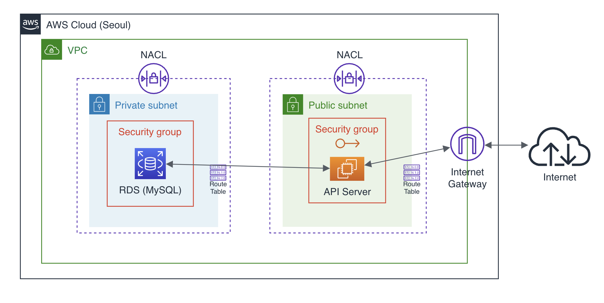
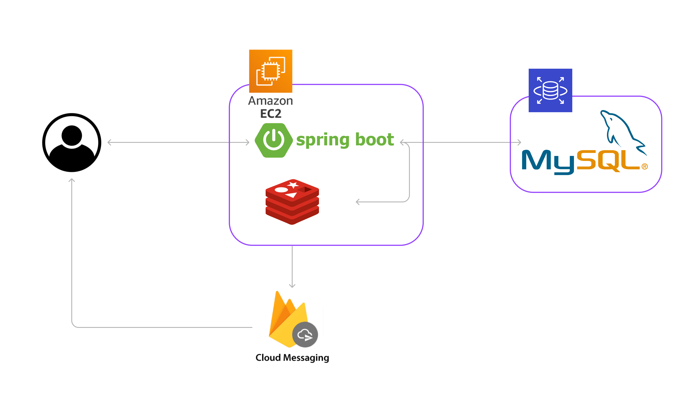

# DMU-BackEnd
동양미래대학교 홈페이지의 정보들을 활용하여 더 나은 편리성을 제공하기 위해 만들어진 API 서버입니다.

## Team Members
|                     박기중                     |                   이종원                    |
|:-------------------------------------------:|:----------------------------------------:|
| [GiJungPark](https://github.com/GiJungPark) |[LeeJongWon](https://github.com/LJW22222) |
|    식단, 일정, 공지사항 크롤링 서비스 제작 AWS 서버 구축    | FCM을 활용한 알림 전송 Redis를 활용한 구독 시스템 제작  |

  

## Tech Stack
### Develop Environment
 
 
 

### Library
 
 

  

## Architecture
### AWS

### Server

